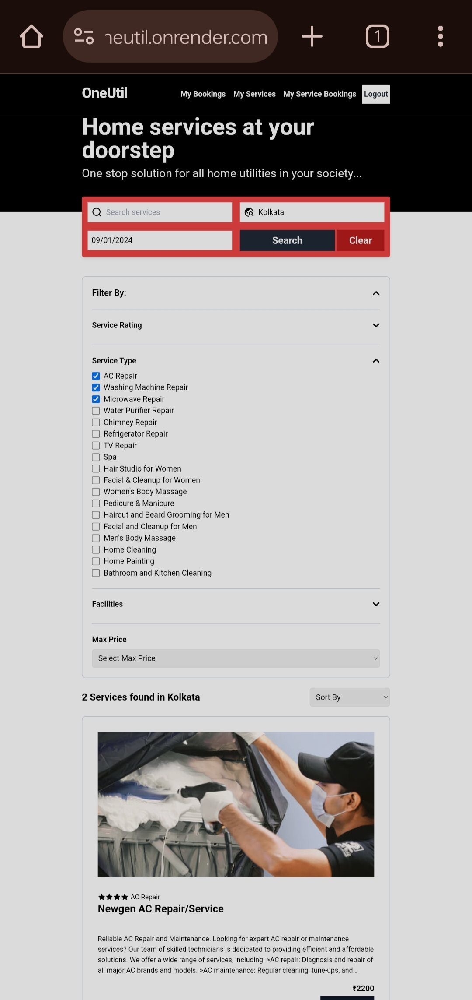
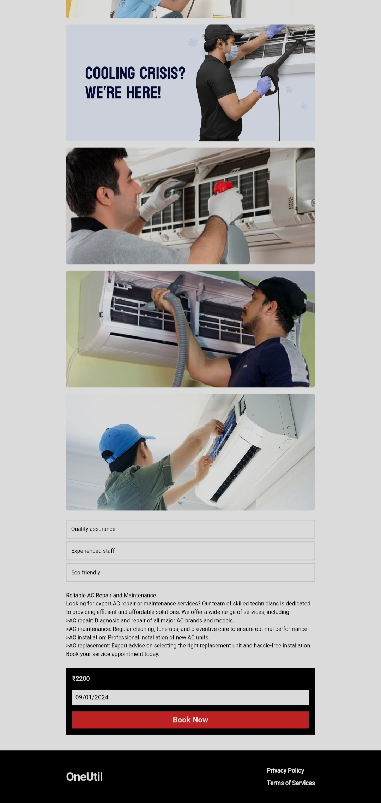
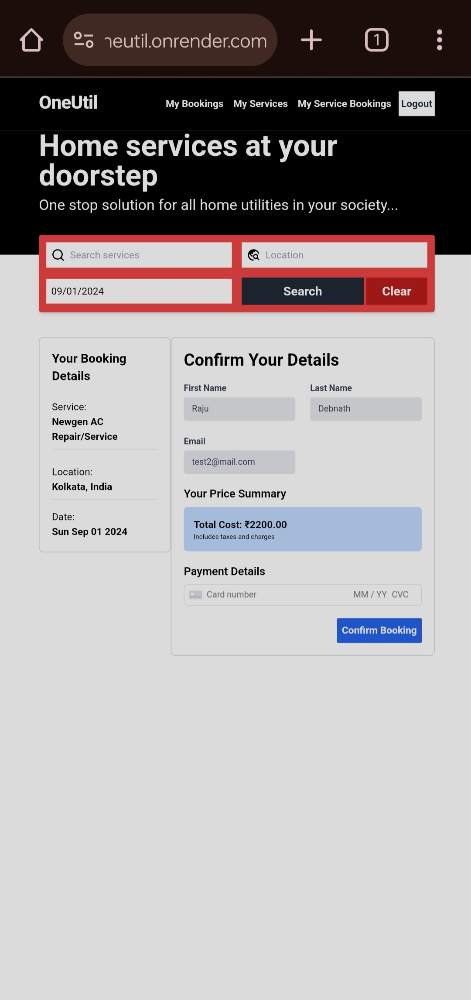
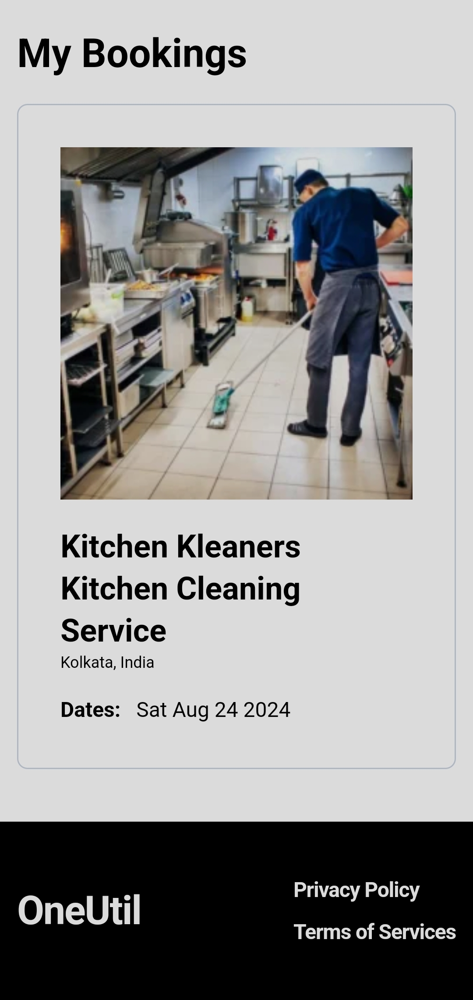
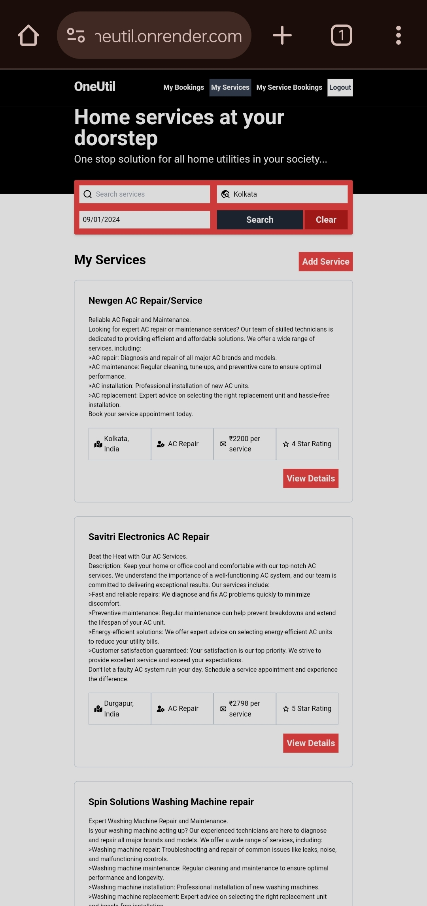

# Home Utility Service Booking System:
This project is a full-stack web application built using the MERN (MongoDB, Express.js, React, Node.js) stack. It provides a platform for users to book various home utility services, including cleaning, plumbing, electrical repairs, and more.  
### Live site: [oneutil.onrender.com](https://oneutil.onrender.com/)

## Getting Started
Steps to run this project:
Make necessary changes in .env files of both frontend and backend according to your server setup, databse connection, assigned port number etc.

### Step1:
Go in the backend folder and run the backend server.
run the server:
```bash
cd .\backend\
npm i
npm run dev
```

### Step2:
Go in the frontend folder and run the frontend server.
run the frontend:
```bash
cd ./frontend
npm i
npm run dev
```

### Step3 (optional):
Go in the backend folder and run the backend test server. This step is for performing playright end to end tets.
run the backend test server:
```bash
cd ./backend
npm i
npm run e2e
```

## Key Features:
* User Authentication: Users can create accounts, log in, and securely manage their profiles using bcryptjs for password hashing and session cookies for authentication.
* Service Creation and Management: Users can create their own services, providing detailed information such as service type, price, location, category, facilities, and images. They can also edit and manage their existing services.
* Search and Filtering: The application offers advanced search and filtering capabilities, allowing users to find services based on location, service type, rating, price, and other criteria.
* Booking and Payment: Users can book a service for a specific date and time. The booking process includes payment integration using Stripe for secure transactions.
* Booking Management: Both users and service providers can view and manage their booked services, including confirmation details and status.
* Error Handling: The backend API incorporates robust error handling mechanisms to prevent crashes and provide informative error messages to users.
* Data Storage: MongoDB is used to store user data, service information, and booking details in a secure and scalable manner.
* Frontend Development: The frontend is built using React, providing a modern and interactive user interface. Tailwind CSS is used for styling, and React Router Dom for navigation between different pages.
* Testing: The application undergoes thorough end-to-end testing using Playwright to ensure quality and prevent bugs.
* Deployment: The final product is deployed on Render for easy access and availability.

## Screenshots
|  |  |  |
| :-------------: | :-------------: | :-------------:  |
|  |  |  |
| :-------------: | :-------------: | :-------------:  |
